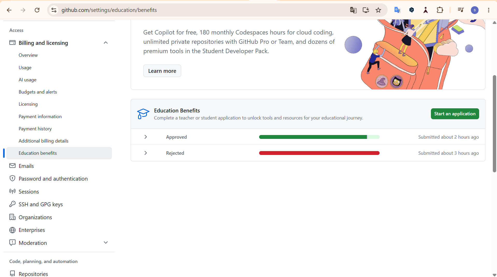

::: callout-note
This was my first experience using Positron and GitHub Pages.
:::

## ***Download and Install Positron. As you watch the videos in Step 1 and Step 3, follow the activities in the video and be familiar with Positron.***

> I downloaded and installed Positron by following the instructions in the workshop materials. While watching the videos in Step 1 and Step 3, I followed the demonstrations and practiced using the software on my computer. Since this was my first time using Positron, I could not do everything smoothly. Many features and functions were new to me, so it took some time to understand how to use them. However, through creating a project, organizing files, and working with a Quarto document, I was able to learn the basic workflow of Positron. I am still not fully comfortable using Positron, but I hope to become more familiar with it throughout this semester.

## ***Based on what you learned from Step 1 and Step 3, what do you like about Positron compared with RStudio?***

> Based on what I learned from Step 1 and Step 3, there are two things that I particularly like about Positron compared with RStudio.
>
> First, I like that Positron supports multiple programming languages. While RStudio is mainly focused on R, Positron provides a more flexible environment for working with R, Python, Quarto, and other tools. I think this is useful because many data science projects require more than one programming language. Having everything in one environment can make the workflow more efficient.
>
> Second, I like the Positron Assistant feature. It allows users to interact with AI directly inside the development environment. The assistant can answer questions, explain code, and help solve problems while working on a project. Since I am still learning, I think this feature can help me study and code more efficiently.

## ***In step 4, the video demonstrates how you can use AI.***

### **Describe the various ways you can use AI inside Positron. Some are free while others are not.**

> AI can be used in Positron in several ways. For example, it can answer questions, explain code, help with debugging, and suggest code. AI can also help users learn new functions and understand programming concepts more quickly.
>
> Another feature I found interesting is that AI can help users work with data more easily. For example, users can explore data, sort and filter information, and receive help generating code for these tasks. This can save time and make it easier to learn different coding approaches.

### **Which AI tools have you installed or set up? Which AI tools did you find beneficial for you?**

> I briefly explored Positron Assistant during the workshop. I found it helpful because it can answer questions and explain code directly inside Positron. As a beginner, there are many times when I am not sure how to approach a problem, so having an AI assistant available in the same environment seems useful.

### **I strongly recommend using GitHub Copilot, which is free if you apply for an education account.**

#### Apply for it and take a screenshot showing you were accepted into the education program.

> 

#### Play with it and do you find it helpful or distracting?

> After trying GitHub Copilot, I found it both helpful and somewhat challenging. One feature that I found very useful is that it automatically suggests and completes code while I am typing. This can make coding faster and help me work more efficiently.
>
> However, I feel that GitHub Copilot gives answers too quickly. Instead of thinking through a problem myself, I may be tempted to accept the suggested code without fully understanding it. Because of this, I think beginners need to be careful about when and how they use this tool.
>
> At the same time, I think it can be very useful for people who already have programming experience because it can save time and reduce repetitive work. Overall, I think GitHub Copilot is a powerful tool, but it should be used in a way that supports learning rather than replacing it.

> ## Please e elaborate Publish this report to GitHub Pages and provide a URL to the GitHub Pages for the report. Note that although both GitHub Pages and GitHub repo are online, they are different. GitHub Pages is a website publishing service that hosts the rendered HTML from a QMD file.

<https://sora-sky-sora.github.io/intro-positron-reflection/Hosoda-Sora-W01-Reflection-Intro-Positron.html>